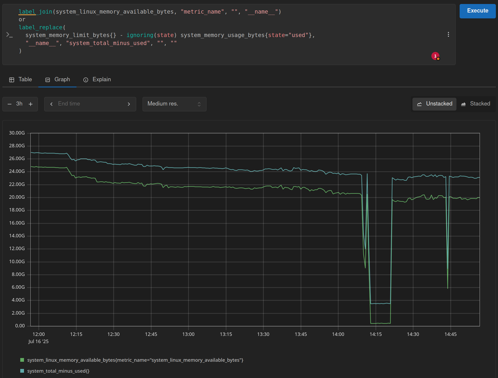
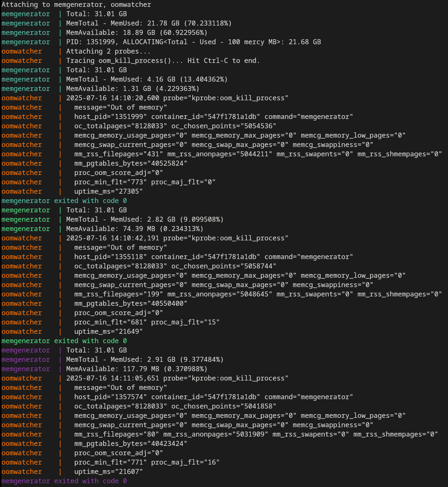
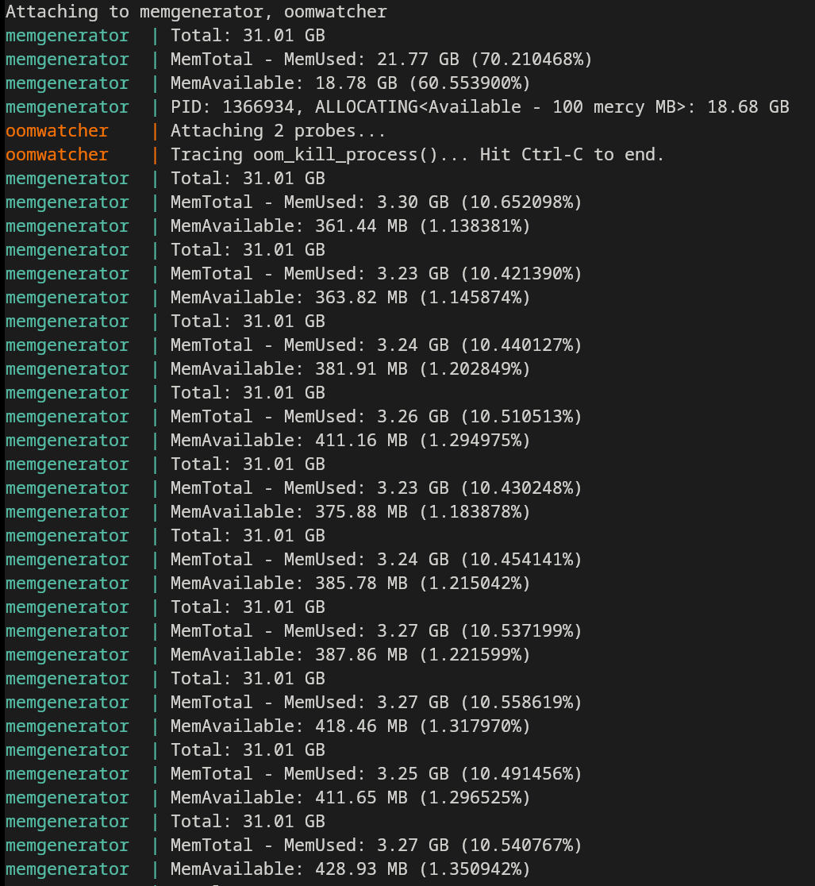

# 🔍 Which Kernel Metrics Should You Use to Monitor Memory?

Memory management is one of the most intricate—and fascinating—subsystems in the Linux kernel. With its fine-grained memory states and multiple accounting strategies, it provides many ways to interpret memory usage (sometimes leading to confusion).

Fortunately, most of these memory metrics are exposed in the [/proc/meminfo](https://man7.org/linux/man-pages/man5/proc_meminfo.5.html) file, making them accessible for inspection and monitoring:

```
$ cat /proc/meminfo
MemTotal:       32512140 kB
MemFree:        16227240 kB
MemAvailable:   23151880 kB
Buffers:         2107068 kB
Cached:          5616492 kB
...
```

The [/proc/meminfo](https://man7.org/linux/man-pages/man5/proc_meminfo.5.html) file doesn’t provide a single, clear memory utilization value. Instead, it lists multiple fields that appear to represent similar concepts—so which one should you trust? Which ones should you use to calculate the actual free memory?

**Should you rely on MemFree? Or maybe MemAvailable? What about summing MemFree + Cached + Buffers, assuming all of them are "freeable" states?**

Before Linux kernel 3.14, this was a common source of confusion, often leading to misleading or inconsistent memory usage calculations. To address this, the kernel introduced a new metric: `MemAvailable`. MemAvailable was specifically added to provide a more accurate estimate of how much memory is **actually available for applications**, without requiring users to understand the internals of the kernel's memory management. Introduction to the kernel: https://git.kernel.org/pub/scm/linux/kernel/git/torvalds/linux.git/commit/?id=34e431b0ae398fc54ea69ff85ec700722c9da773

Monitoring tools like `free`, `top` or `ps` switched to rely on `MemAvailable` since version `v4.0.1`, [reference commit](https://gitlab.com/procps-ng/procps/-/commit/2184e90d2). On the other hand, many monitoring agents still rely on old usage formula: `Used = Total - Free - Cached - Buffers - Sreclaimable`.

## Why is important using the right metrics?

**There is an average difference of 6% between the two most common formulas to compute memory utilization, which is not negligible.** This means that depending on the formula used, one might mistakenly believe there is free memory available, when in fact it could trigger the OOM killer.

From a sysadmin perspective, relying on inaccurate metrics can lead to improper memory provisioning—either over-allocating resources and wasting costly hardware, or under-allocating and risking unexpected crashes and downtime.



The following command can be used to visualize the memory metrics collected using the OpenTelemetry
Collector hostmetrics receiver:

```bash
sudo docker compose --profile monitoring up
```

Check the metrics using PromQL in
[http://localhost:9090](http://localhost:9090).

## 🚀 Try it out! (Only Linux systems)

**⚠️ Caution: Use at your own risk! The following test intentionally pushes your system's memory usage to its limits. There’s a small chance that the kernel's OOM killer won't target the memory-hogging container — which could freeze your entire system. Make sure you’re not running anything important before continuing.**

**Ideal environment**: No other high memory processes running (Browser, Slack,
etc.).

Two main containers are provided to verify the actual free memory:

- [memgenerator](./memgenerator/): Simulates high memory usage by allocating one of two formulas:
  - Legacy formula: Total - Free - Cached - Buffers - SReclaimable
  - Modern formula (optional): MemAvailable (used when the --memAvailable flag is set)

    It also logs the system’s memory stats every 20 seconds to show you what’s happening in real-time. To prioritize the process to be killed by the kernel's OOM killer, it sets its self [oom_score_adj](https://man7.org/linux/man-pages/man5/proc_pid_oom_score_adj.5.html) to the maximum value.
- [oomwatcher](./oomwatcher/): Attaches an eBPF trace to the kernel’s oom_kill_process function, logging detailed context about any process killed by the OOM killer.

To make the difference more noticeable, the number of bytes actually allocated is reduced by 3% compared to the amount returned by the legacy or modern formula. This margin can be adjusted using the `--mercybytes` flag.

### Run the Test with the Legacy Formula

The following command disables swap (to ensure only physical memory is considered), runs the containers, and re-enables swap afterward:

```bash
sudo swapoff -a && { sudo docker compose --profile memgen up; sudo swapon -a; }
```

Since the legacy formula tends to overestimate available memory by ~6–7%, the system should run out of memory quickly — causing the OOM killer to repeatedly terminate `memgenerator`:



### Run the Test with MemAvailable

This time, we run `memgenerator` using the "modern" MemAvailable metric, which more accurately reflects the true amount of free memory:

```bash
sudo swapoff -a && { sudo env MEMGEN_COMMAND=--memAvailable docker compose --profile memgen up; sudo swapon -a; }
```

With this approach, the system should reach near-full memory usage without triggering the OOM killer:



> 💡 Why disable swap?
Disabling swap ensures all memory usage comes from physical RAM, removing the uncertainty of inactive pages being written to disk. This provides a cleaner, more predictable test environment.
